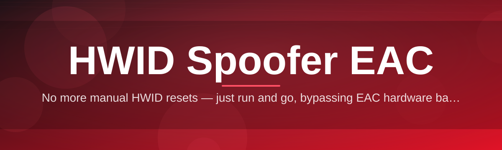

# hwid-spoofer-eac-utility 🛡️✨

  

*A lightweight identifier-reset utility for testing anti-cheat resilience against hardware fingerprinting.*

  

---

## 🧭 Overview

**What this is NOT:** a plug-and-play miracle that magically undoes account history, nor a shady binary you download from a sketchy forum post. It's not a black box either — every module is documented, versioned, and built to be inspected before you ever run it.

**What it actually is:** `hwid-spoofer-eac-utility` is an open-source research tool for understanding and testing how hardware ID (HWID) fingerprinting works in modern anti-cheat ecosystems like EAC (Easy Anti-Cheat). It rewrites the identifiers your machine exposes — disk serials, motherboard UUIDs, network adapter GUIDs, and volume signatures — so developers, QA teams, and security researchers can validate detection logic, test ban-appeal workflows, or simply understand what data points get fingerprinted in the first place.

This project exists because HWID-based enforcement is opaque by design, and opacity breeds bad tooling. We wanted a transparent, community-audited alternative — something you can read line-by-line, fork, and improve. It's built for tinkerers, driver-level engineers, QA testers running repeatable environments, and anyone curious about the plumbing beneath anti-cheat telemetry.

> [!NOTE]
> This tool operates entirely at the identifier layer. It doesn't touch game files, memory, or network packets — it's scoped narrowly to hardware fingerprint values reported by the OS.

---

## 🔥 What Makes It Tick

- **Deep Identifier Remapping** — rewrites disk, SMBIOS, MAC, and volume-level identifiers in one coordinated pass instead of patching them piecemeal.

- **Session-Based Reset Profiles** — spin up a fresh identity snapshot per session without permanently altering your registry baseline.

- **Rollback Snapshotting** — every change is journaled, so a single click restores your original hardware fingerprint state.

- **Driver-Level Consistency Checks** — validates that spoofed values remain internally consistent across WMI, registry, and low-level driver queries — half-spoofed states are how detection happens.

- **Zero Dependency Footprint** — a single standalone executable, no runtime installers, no background services phoning home.

- **Portable Config Profiles** — export/import your spoof profile as a `.json` config for repeatable test environments across machines.

- **Verbose Diagnostic Logging** — every operation logs what changed, what didn't, and why — built for people who want to *understand*, not just click a button.

- **Dark-First Interface** — a minimal control panel designed for clarity over clutter, because tooling shouldn't fight you.

> [!TIP]
> Run a dry-run diagnostic first (`Scan` mode) before applying any changes — it shows exactly which identifiers your system currently exposes.

---

<strong>🚀 How to Get Started</strong>

Getting up and running takes about two minutes:

1. **Visit the landing page** — head to the project site linked in the download button below.

2. **Grab the latest build** — download the standalone `.exe`, no installer wizard, no bundled bloat.

3. **Run it as Administrator** — hardware-level identifier access requires elevated privileges on Windows 10/11.

4. **Scan → Review → Apply** — check the current fingerprint report, review what will change, then confirm.

> [!IMPORTANT]
> Always create a system restore point before your first run. Hardware identifier changes are reversible through this tool, but a manual restore point is cheap insurance.

<strong>🖥️ System Requirements</strong>

| Requirement | Details |
|---|---|
| OS | Windows 10 (64-bit) or Windows 11 |
| Architecture | x64 only |
| Privileges | Administrator required |
| Dependencies | None — fully standalone binary |
| Disk Space | ~40 MB |
| .NET / Runtime | Not required |

  

---

## ⚙️ How It Works

The architecture is intentionally simple — three layers, one clean pipeline:

1. **Enumeration** — the tool queries WMI, registry hives, and low-level device descriptors to build a map of every identifier currently exposed to userland and kernel-mode callers.

2. **Profile Generation** — a new identity profile is generated, either randomized or loaded from a saved `.json` config, ensuring internal consistency across all identifier classes.

3. **Application Layer** — the new values are written through the appropriate driver interfaces, replacing the old fingerprint atomically where possible.

4. **Verification Pass** — the tool re-queries the system to confirm the new values persisted correctly and match across every subsystem.

5. **Snapshot & Log** — a rollback snapshot and a human-readable diff log are saved before the session closes.

> [!WARNING]
> Interrupting the Application step mid-write (forced shutdown, crash, power loss) can leave identifiers in a half-changed state. Use the built-in rollback if this happens — don't manually edit the registry to "fix" it.

---

<strong>🩺 Troubleshooting</strong>

**Q: The tool says "Access Denied" on launch.**
A: Right-click → Run as Administrator. Hardware identifier writes require elevated privileges on both Windows 10 and 11.

**Q: My antivirus flagged the executable.**
A: Low-level identifier tools frequently trigger heuristic (not signature) detections because they touch driver-adjacent APIs. Check the SHA-256 hash listed on the landing page against your download.

**Q: I applied changes but some values reverted after reboot.**
A: A handful of identifiers are re-derived by firmware or NIC drivers on boot. Re-run the Verify pass after restarting — persistent profiles handle this automatically in most cases.

**Q: Can I undo everything back to my original hardware fingerprint?**
A: Yes — open the Snapshot manager and select "Restore Original." This reverses every change from that session in one action.

**Q: The app won't detect my network adapter's identifier.**
A: Some virtual adapters (VPN, virtualization bridges) expose non-standard descriptors. Disable virtual adapters temporarily and re-scan.

**Q: Does this affect other software or games installed on my system?**
A: No — it only touches the identifier layer described above. It doesn't modify game files, save data, or unrelated applications.

<strong>🎨 UI / UX Details</strong>

The interface leans minimal-dashboard rather than wizard-driven:

- **Themes** — Dark (default), Light, and a high-contrast "Terminal" mode.

- **Keyboard Shortcuts:**

  | Shortcut | Action |
  |---|---|
  | `Ctrl+S` | Run Scan |
  | `Ctrl+G` | Generate new profile |
  | `Ctrl+Enter` | Apply changes |
  | `Ctrl+R` | Open rollback snapshot manager |
  | `Ctrl+L` | Open verbose log viewer |

- **Settings persistence** — your theme, log verbosity, and last-used profile are remembered between sessions in a local config file (no cloud sync, no telemetry).

- **Status ribbon** — a persistent top bar shows current identifier consistency state at a glance (green = consistent, amber = partial, red = mismatch).

---

## 🤝 Contributing & Community

Contributions, issues, and forks are genuinely welcome — this project grows because people poke at it.

- Open an issue for bugs, feature ideas, or documentation gaps.

- Submit pull requests against the `dev` branch; keep changes scoped and described clearly.

- Discussion threads are the right place for "why does X identifier behave like this" style questions.

> [!TIP]
> Before opening a PR, run the included diagnostic suite locally and paste the output in your description — it saves everyone review time.

We follow a standard Code of Conduct: be respectful, be specific, and assume good faith.

---

## 📜 License

Released under the **MIT License**, 2026.

See the full text here: [MIT License](LICENSE)

---

## ⚠️ Disclaimer

This tool is provided strictly for **educational, research, and testing purposes** — understanding fingerprinting mechanics, validating detection systems, and supporting legitimate QA workflows. It is not affiliated with, endorsed by, or associated with Epic Games, Easy Anti-Cheat, or any game publisher. Usage that violates a game's terms of service or platform End User License Agreement is the sole responsibility of the user. The maintainers assume no liability for how this software is used downstream.

---

